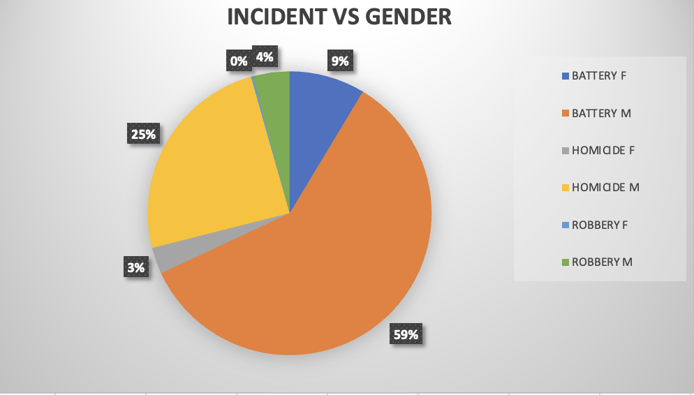
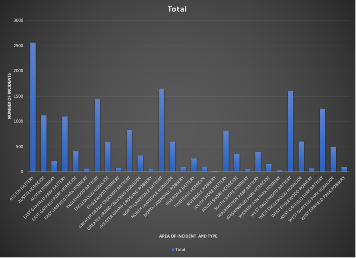
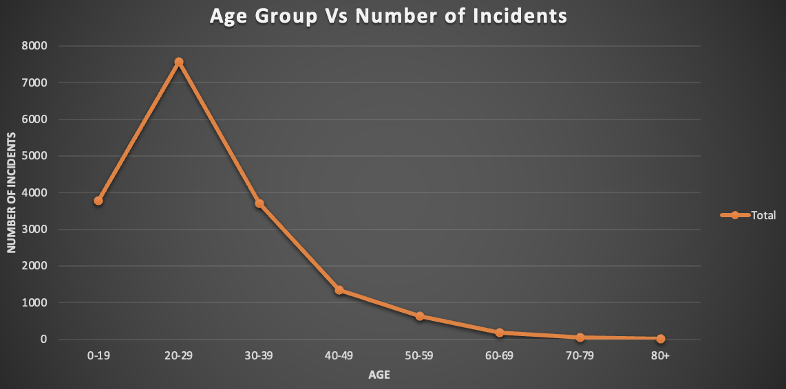

# Crime In Chicago's Top 10 Dangerous Areas 
This project was created as part of the UNC Data Analytics Bootcamp.

## Authors
- Hazel Mena ([GitHub](https://github.com/hazelmena))
- Nathanial Hermann [([GitHub](https://github.com/nathanialhermann))
- Kaija Gregory ([GitHub](https://github.com/kaijaygregory))

 ## Overview
The purpose of this project is to analyze the crime rate in 10 of the most dangerous areas of Chicago. This was done by utilizing a dataset of crime rate in Chicago which included multiple areas and was later narrowed down to the top 10 dangerous. There is analysis' done between gender, race, as well as age against the incident or crime committed. The top 10 dangerous areas of Chicago we decided to focus on for this project are: Austin, Englewood, East Garfield Park, Grand Crossing, North Lawndale, Riverdale, South Shore, West Garfield Park, Washington Park, West Englewood. 

## Table of Contents
- [Visuals](#visuals)
- [Conclusions](#conclusions)
- [Usage](#usage)
- [Acknowledgments](#acknowledgments)

## Visuals

*This pie graph displays the difference between genders and each crime committed by that gender.*

*A graph that allows users to view which area of the 10 has the most crimes committed.*

*This is a line graph that offers a perspective on which age group is committing the most crime as well as least.*

## Conclusions
The following are conclusions/observations we have made from the following graphs made from the dataset.
88.3% of the monthly crime rate in these areas are committed by males, as, 11.7% are committed by females. 
Out of the 6 races recorded for each incident, Indian had the lowest crime cases at just 6 out of 35,090 cases.  
Most crimes were committed by someone in the age group of 20-29 while the least crimes committed were by the age group 80+. 
In the month of July, the crime rate was at its highest with 4383 crime cases. Due to that it shows that out of the year there are more crimes committed in July than any other month.  
More crimes are committed on a Sunday than any other day. Saturday has the second highest crime rate.  
Austins crime rate for battery is the highest compared to battery crime rates in the 9 other areas. 

## Usage
Based on our finds we believe that this data can help fellow Chicago police officers with an intervention plan and use the data to know what groups to target and when to patrol more throughout the year. 

## Acknowledgments 
We would like to express our gratitude to Professor Josh Crosby for their valuable guidance and support throughout the duration of this project. Their expertise and insights greatly contributed to the success of this work. We also extend our thanks to our dedicated tutors who provided assistance and assistance along the way.

